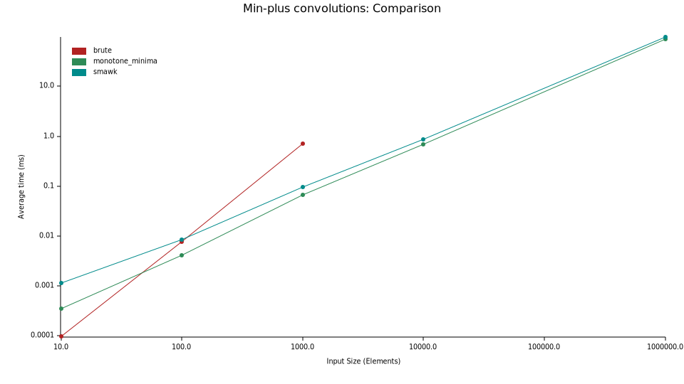
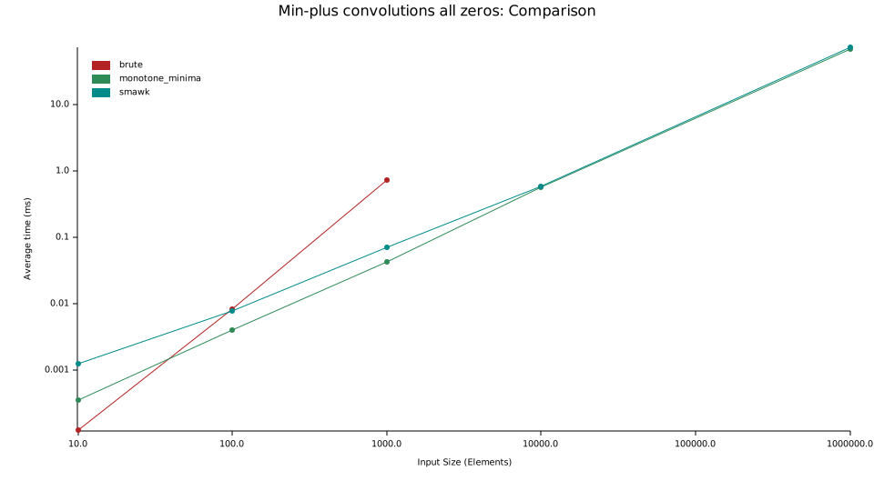
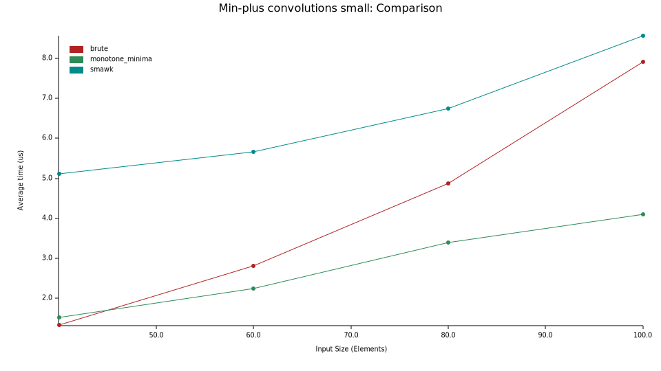
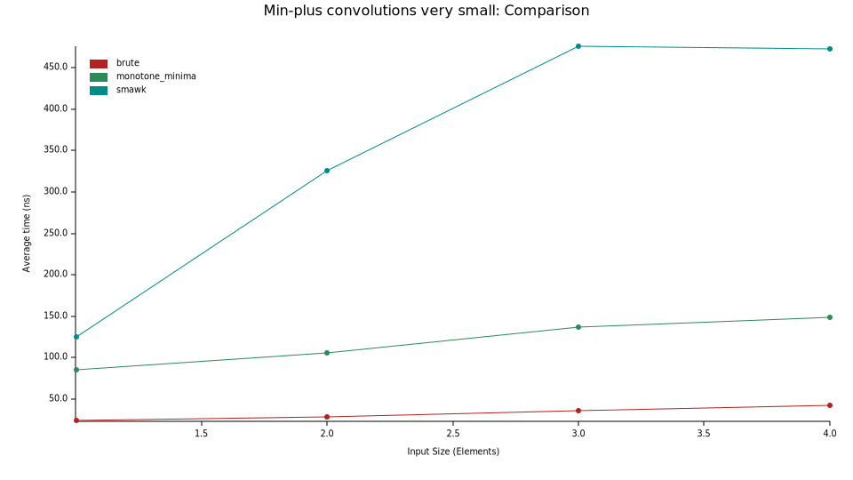

Convex min-plus convolution を実現するアルゴリズムの実行時間を比較します。

# やり方

長さ N の convex な `Vec<i32>` を２本生成して、それらの min-plus convolution を３通りの方法で計算します。

1. `brute`: 定義どおり計算します。(Θ (N²))
2. `monotone_minima`: [いわゆる monotone minima のアルゴリズム](https://dic.kimiyuki.net/monotone-minima)で計算します。(Θ (N lg N))
3. `smawk`: [SMAWK アルゴリズム](https://dic.kimiyuki.net/smawk-algorithm)で計算します。(Θ (N))

Convex なベクターを「ランダムに」生成するとある部分はすべて同じ方法で生成されています。詳しくはコードをご覧いただくとよいのですが、ざっくりいうとたとえば２階差分が一様分布になります。

# 結果

## 通常のサイズでの比較（対数スケール）

SMAWK が monotone-minma に勝てなくて悲しい気持ちになっています。

## 通常のサイズの all-zero ベクターでの比較（対数スケール）

このレポジトリの monotone-minima は all-zero のときに実際に Θ (N lg N) かかるのでそれを試してみたのですが、結果はあまり変わりません。

## 小さめなベクターでの比較（線形スケール）

Monotone minima は 40 ちょっと、SMAWK は画面外ですがおそらく 120 くらいで逆転しそうに見えます。

## とても小さなベクターでの比較（線形スケール）

これくらい違います。

# 結論

ベンチマークに使った SMAWK アルゴリズムがバグっていないと仮定するならば、monotone minima の高速化目的で競プロで使うメリットはなさそうという結論になってしまいます。（ただし、[noshi91 さんのツイート](https://twitter.com/noshi91/status/1452244188351762436?s=20)にあるようなメリットはあるようです。）

しかし[週刊 spaghetti_source さんによる先行研究](https://topcoder-g-hatena-ne-jp.jag-icpc.org/spaghetti_source/20120923/1348327542.html)によると SMAWK のほうが 1.5 倍程度有利なケースがあるようです。

1 倍なのか 1.5 倍なのかは実装の詳細にかなり依存しそうなのでなんとも言えない感じになりました。

# 有識者のみなさまにお願い

もし私のためにお手間を割いてくださるならば、次のことを試みてくださると嬉しいです。私の不甲斐ないベンチマークのために SMAWK アルゴリズムさんが今後不当により不遇な扱いを受けてしまうととても心苦しいので、ぜひです。

- バグ報告
- monotone minima, SMAWK アルゴリズムの定数倍高速化
- 何らかの分布を仮定したときの両アルゴリズムの実行時間の振る舞い、特に今回の分布（実装定義で申し訳ありません。）で monotone minima が期待線形時間になるかどうかなどについての示唆

Issue や PR などの際には、お手数をおかけしますが、私が GitHub の通知に気づかないことがあるので、[私のツイッターアカウント](https://twitter.com/ngtkana) へもご一報頂けると幸いです。

